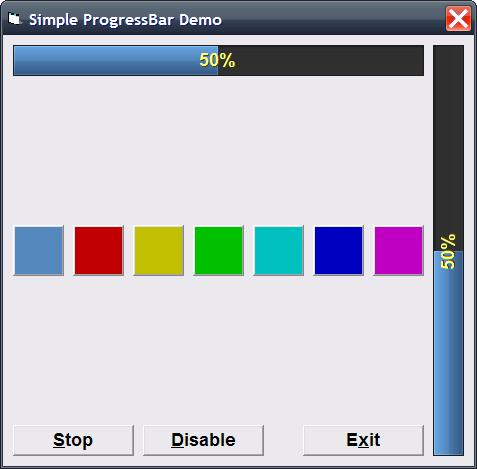



## ProgressBar Simple

### Description

Add BorderColor property

A simple ProgressBar control.

You can set the control horizontal or vertical.

Change te bar color, caption alignment.

See the control properties for more settings.
 
### More Info
 

             |
---                |---
**Submitted On**   |2011-11-22 02:00:00
**By**             |[Ben Vonk](https://github.com/Planet-Source-Code/PSCIndex/blob/master/ByAuthor/ben-vonk.md)
**Level**          |Intermediate
**User Rating**    |5.0 (10 globes from 2 users)
**Compatibility**  |VB 6\.0
**Category**       |[Custom Controls/ Forms/  Menus](https://github.com/Planet-Source-Code/PSCIndex/blob/master/ByCategory/custom-controls-forms-menus__1-4.md)
**World**          |[Visual Basic](https://github.com/Planet-Source-Code/PSCIndex/blob/master/ByWorld/visual-basic.md)
**Archive File**   |[ProgressBa22152611222011\.zip](https://github.com/Planet-Source-Code/ben-vonk-progressbar-simple__1-74155/archive/master.zip)

